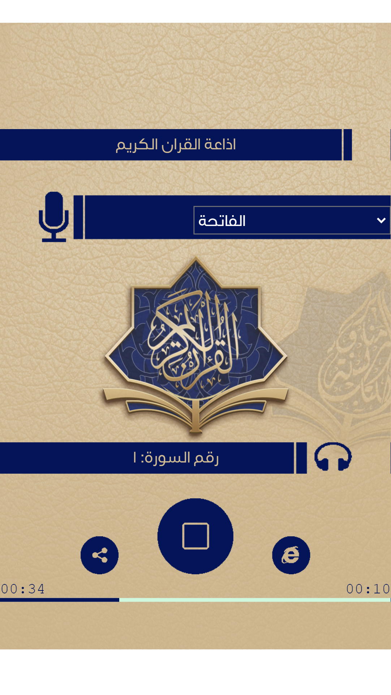

## Application of the  Quran

### got cmd  c:\

## git clone   the project

### quran_radio_ionic> npm install

### npm install

###image of Application :

## ionic serve

#for build  android

### ionic_quran_radio>  ionic cordova build android --prod

### there olny 4 soura  1,2,3,4   but you can add  your soura in  assets\quran\quran  yhe title must ( 1-2-3-4......114) 
